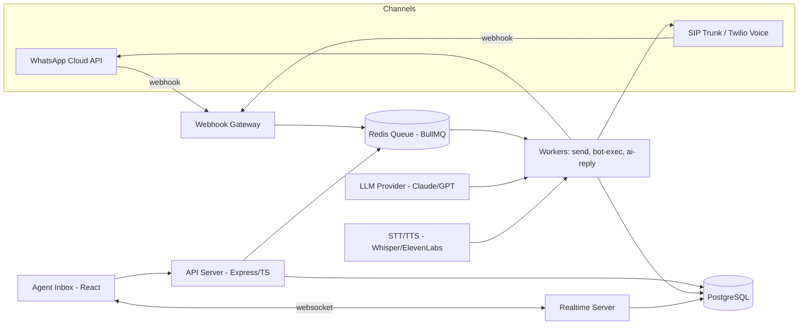

# Architecture — ConnectHub

## High-level diagram

## Components

| Component       | Role                                           | Tech                                  |
| --------------- | ---------------------------------------------- | ------------------------------------- |
| Webhook Gateway | Receives Meta/telephony webhooks, must ack <5s | Express, thin, no business logic      |
| Queue           | Decouples ingress from processing              | Redis + BullMQ                        |
| Workers         | Send messages, run bot flows, call LLM         | Node.js worker processes              |
| API Server      | Auth, CRUD, agent actions                      | Express + TypeScript + zod validation |
| DB              | Source of truth                                | PostgreSQL (Prisma or Drizzle)        |
| Realtime        | Live inbox updates, agent presence             | Socket.IO or native WS                |
| Frontend        | Agent inbox, campaign builder                  | React + Vite                          |
| AI Layer        | Auto-reply, voicebot                           | LLM API + STT/TTS providers           |

## Why queue-first

Meta requires webhook ack within 5 seconds or it retries/drops. Never do LLM calls, DB writes with heavy joins, or external API calls inside the webhook handler itself — always: validate signature → push to queue → return 200 immediately.

## Data model (core tables)

- `users` — dashboard/agent logins
- `contacts` — end customers (phone number is the identity key for WhatsApp)
- `conversations` — one per contact, tracks assigned agent + status
- `messages` — belongs to conversation, direction (in/out), channel (whatsapp/call), status (sent/delivered/read/failed)
- `templates` — Meta-approved message templates, status field (pending/approved/rejected)
- `campaigns` — broadcast jobs, target list, stats
- `bot_flows` — JSON flow definitions
- `bot_sessions` — per-contact state machine position

## Environment separation

- `local` — docker-compose, fake WhatsApp sender, no real Meta calls
- `staging` — real Meta test number, sandboxed
- `production` — real Meta Business number, DLT-registered if SMS involved

## Third-party dependency decisions (fill in as you decide)

- WhatsApp: [ ] Direct Meta BSP [ ] Via Gupshup [ ] Via 360dialog [ ] Via Twilio
- Voice/SIP: [ ] Twilio Voice [ ] Exotel [ ] Plivo [ ] Raw SIP trunk
- LLM: [ ] Anthropic API [ ] OpenAI [ ] Both, provider-agnostic wrapper
- STT/TTS: [ ] Whisper + ElevenLabs [ ] Deepgram + Azure [ ] Other

## Non-negotiables

- Webhook handlers: signature verification always on, even in dev (use test secret)
- No secrets in git, ever — `.env` gitignored, `.env.example` committed
- All outbound WhatsApp sends go through the queue, never synchronous from API routes
- Rate limiting on broadcast sends respects Meta's messaging tier (starts at 250/day, scales with quality rating)
